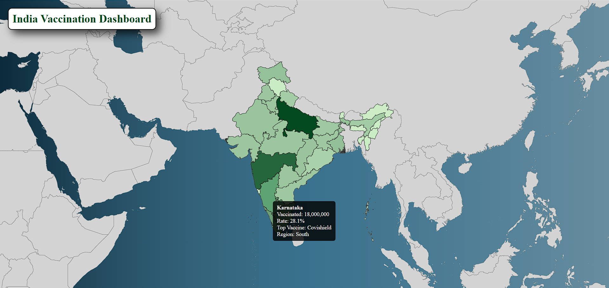

# India Vaccination Map Dashboard

A **React-based interactive India vaccination map** that visualizes vaccination data for all Indian states using a **gradient color-coded map**. This dashboard allows users to explore state-wise vaccination statistics and provides an easy-to-understand tooltip and color legend.  




## Features

- **Interactive India Map**: Hover over states to view vaccination data including:
  - Total vaccinated
  - Vaccination rate
  - Top vaccine type
  - Region
- **Gradient Color Coding**: States are color-coded based on vaccination numbers using a smooth gradient.
- **Global Map Context**: India is highlighted while other countries are displayed in neutral gray.
- **Tooltip**: Smooth, dynamic tooltips that display detailed information per state.
- **Gradient Legend**: Visual legend showing the vaccination range and corresponding colors.
- **Loader Component**: Displays a loader until map and data are fully loaded.
- **Responsive Design**: Works on different screen sizes.
- **Background Tint & Smooth Hover**: Map features a subtle left-to-right background tint, and smooth hover effects for better user experience.


## Demo

You can check the live demo here: https://india-vaccination-map-dashboard.vercel.app/
## Technologies Used

- **React.js** - Frontend library  
- **React Simple Maps** - For rendering the maps  
- **D3.js** - For color scales and gradient calculations  
- **JSON** - For vaccination data  
- **CSS & SVG** - Styling, tooltip, legend, and background tint  


## Installation

1. Clone the repository:

```bash
git clone https://github.com/gaurav0830/IndiaVaccinationMap.git
cd india-vaccination-map
```
2. Install dependencies:

```bash
npm install
```

3. Start the development server:

```bash
npm start
```
    
